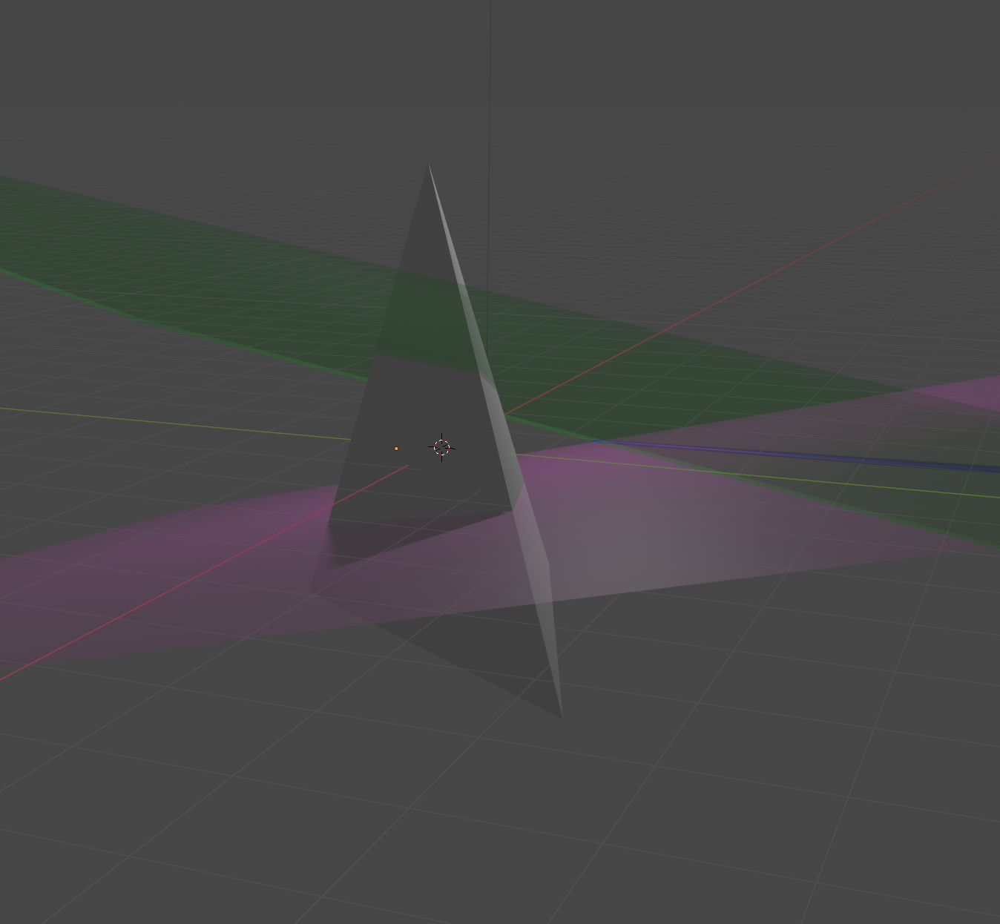

# Desargues Theorem

## $tA + (1 - t)B = uA + vB$ (Parameterized Line)

\begin{align*}
ℓ &= \{ u(X₁ : Y₁ : Z₁ : W₁) + v(X₂ : Y₂ : Z₂ : W₂) : (u, v) ≠ 0 \} \\
  &= \{ (uX₁ + vX₁ : uY₁ + vY₂ : uZ₁ + vZ₂ : uW₁ + vW₂) : (u, v) ≠ 0 \} \\
\end{align*}
But since $u + v ≠ 0$ then we see that for any $P ∈ ℓ$
$$ P \~ (\frac{u}{u + v} X₁ + \frac{v}{u + v} X₁ : \frac{u}{u + v} Y₁ + \frac{v}{u + v} Y₂ : \frac{u}{u + v} Z₁ + \frac{v}{u + v} Z₂ : \frac{u}{u + v} W₁ + \frac{v}{u + v} W₂) $$
Let $t = \frac{u}{u + v}$, then we see $1 - t = \frac{v}{u + v}$ and so
$$ P \~ (t X₁ + (1 - t) X₁ : t Y₁ + (1 - t) Y₂ : t Z₁ + (1 - t) Z₂ : t W₁ + (1 - t) W₂) $$
$$ ⇒ ℓ = \{ tA + (1 - t)B \} $$
so both representations are equivalent.

## $BC, B'C'$ are in $PQ$

$$ u₁(1 : 0 : 0 : β) + v₁(1 : α : 0 : 0) = u₂(1 : 0 : γ : β) + v₂(1 : α : γ : 0) $$
We have a system of equations to solve
$$ u₁ + v₁ - u₂ - v₂ = 0 $$
$$ v₁ α - v₂ α = 0 $$
$$ -u₂ γ - v₂ γ = 0 $$
$$ u₁ β - u₂ β = 0 $$

Generalizing to arbitrary $(X : Y : Z : W)$, we have
$$ \begin{pmatrix}
X₁ & X₂ & -X₃ & -X₄ \\
Y₁ & Y₂ & -Y₃ & -Y₄ \\
Z₁ & Z₂ & -Z₃ & -Z₄ \\
W₁ & W₂ & -W₃ & -W₄ \\
\end{pmatrix}
\begin{pmatrix}
u₁ \\
v₁ \\
u₂ \\
v₂ \\
\end{pmatrix}
= \mathbf{0} $$
Setting the coefficient matrix $M$ for the system of equations
$$ M = \begin{pmatrix}
1 & 1 & -1 & - 1 \\
0 & α & 0 & -α \\
0 & 0 & -γ & -γ \\
β & 0 & -β & 0
\end{pmatrix} $$

```python
sage: var("a b c")
(a, b, c)
sage: M = matrix([
....: [1, 1, -1, -1],
....: [0, a, 0, -a],
....: [0, 0, -c, -c],
....: [b, 0, -b, 0]
....: ])
sage: M * vector([1, -1, 1, -1])
(0, 0, 0, 0)
sage: M.right_kernel()
Vector space of degree 4 and dimension 1 over Symbolic Ring
Basis matrix:
[ 1 -1  1 -1]
```

## Visualization

See `descargues.blend`.



